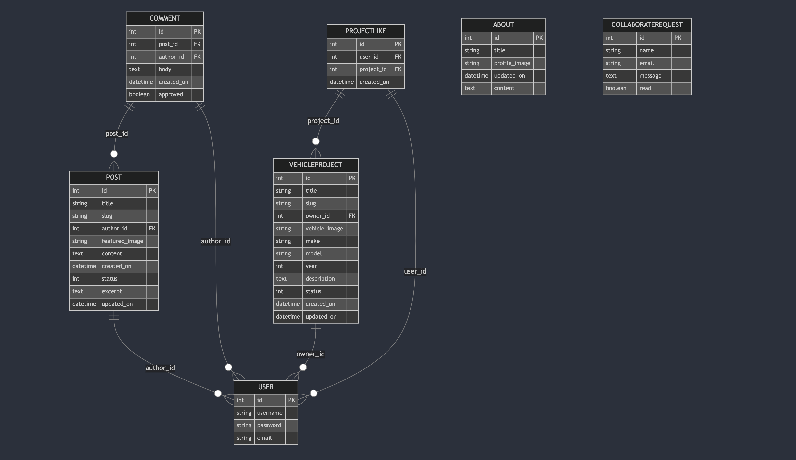

</br>

  

# Motordrive vehicle blog:<br>

## The Ultimate Platform for Car Enthusiasts

Welcome to MotorDrive, your dedicated hub for car enthusiasts! Whether you're showcasing your vehicle builds, browsing others’ projects, or simply immersing yourself in the car community, MotorDrive has everything you need. Explore a platform built for gearheads to share, connect, and celebrate everything on four wheels!

  

## Deployed Site:

[Click here to view deployed site on Heroku](https://motordrive-bb11300a48d1.herokuapp.com/)

  


  

## Table of Contents

- [Introduction](#introduction)
- [UX](#ux)
  - [Account Creation and Login](#account-creation-and-login)
  - [Dashboard Overview](#dashboard-overview)
  - [Vehicle Build Management](#vehicle-build-management)
- [Project Planning](#project-planning)
  - [Wireframes](#wireframes)
  - [Database Schema](#database-schema)
- [Models](#models)
- [Agile Methodologies](#agile-methodologies)
  - [Epics](#epics)
  - [User stories](#user-stories)
  - [Kanban board](#kanban-board)
- [Technologies Used](#technologies-used)
  - [Languages](#languages)
  - [Frameworks](#frameworks)
  - [Libraries & Packages](#libraries--packages)
- [Future Features](#future-features)
- [Testing](#testing)
- [Deployment](#deployment)
  - [Heroku](#Heroku-Deployment)
  - [GitHub](#github)
- [Credits](#credits)
  - [Media](#media)
  - [Acknowledgements](#acknowledgements)

  

## Introduction

Introducing MotorDrive, the ultimate platform for car lovers and gearheads to share their vehicle builds, connect with other enthusiasts, and showcase their automotive passion. From custom mods to classic restorations, MotorDrive provides a space for users to upload pictures, detail their projects, and browse builds from the community. Whether you're just starting a build or already have a finished masterpiece, MotorDrive is your go-to platform.

  

## UX

The user experience of MotorDrive is designed to be straightforward and engaging, offering users an easy way to showcase and manage their vehicle builds, interact with other users, and explore the latest posts from the car community.


### **Scope and Structure**

#### **Scope**    

This project focuses on two main user roles:  

- **Visitors** - Can browse vehicle projects, read build details and engage with content
- **Users** - Can create accounts to like projects and interact with the community

The platform is designed to provide an **engaging automotive community** and **project showcase platform** while ensuring an **intuitive user experience**.

#### **Structure**  

The project is structured around three key areas:  

- **Project Gallery** - A clean display of vehicle builds with detailed project pages
- **User Interaction** - Account management, likes system and community features  
- **Clean & Responsive Design** - A structured layout ensuring clarity and ease of use across devices

### **User Stories**

The project focuses on delivering key functionality for visitors and registered users:

#### **User Authentication** 
- As a visitor, I can register for an account to create and like vehicle projects
- As a user, I can log in to access my account and manage my content
- As a user, I can log out to securely end my session
- As an admin, I can manage user content and accounts

#### **Project Features**
- As a user, I can create new vehicle project posts with details and images
- As a user, I can edit my existing project posts
- As a user, I can delete my projects when needed
- As a visitor, I can browse and view all vehicle projects
- As a user, I can like other users' projects

#### **Site Features**
- As a visitor, I can use the contact form on the About page
- As a visitor, I can view the site responsively on different devices
- As a user, I can receive feedback when my actions are successful

### **Visual Design**

#### **UI Design Approach**  

The platform follows a **modern, minimalist design** focused on showcasing vehicle projects:

- **Mobile-First Responsive Design** 
- **High Contrast Color Scheme**
- **Clean Typography**

#### **Typography & Colors**

The design maintains a clean and modern aesthetic focused on vehicle projects:

**Colors:**

| Color | Hex | Purpose |
|-------|-----|---------|
| Primary Teal | #188181 | Primary buttons, CTAs |
| Teal Hover | #23BBBB | Button hover states |
| Dark Gray | #4A4A4F | Body text, Brand color |
| Light Gray | #6c757d | Secondary text, Like counter |
| Orange Red | #E84610 | Delete buttons, Card badges |
| Heart Red | #E74C3C | Like/heart icons |
| Background | #F9FAFC | Main background |
| White | #FFFFFF | Card backgrounds |

**Typography:**

- **Primary Font**: 'Lato', sans-serif
- **Font Weights**: 
  - Regular text: 400
  - Brand text: 700
  - Headers: Bold
- **Sizes**:
  - Base: 1rem
  - Brand: 2rem
  - Project titles: 1.8rem
  - Like counter: 1.2rem

### **Project Planning**

Development followed an **Agile methodology** with:

- **GitHub Projects** for task management
- **User Story prioritization** using MoSCoW method

**MoSCoW Prioritization:**

| Priority | Features |
|----------|----------|
| Must Have (60%) | User Registration |
| | Project Creation |
| | Like System |
| | Responsive Design |
| | Project Editing |
| Should Have (30%) | User Profiles |
| | Contact Form |
| Could Have (10%) | Additional Social Features |


### Flowchart

The flowchart below illustrates the user flow and interactions within the MotorDrive application. It provides a visual representation of the steps a user takes to navigate through the application, from the home page to managing vehicle projects.

<p align="center">
  
</p>
  

### Account Creation and Login:

<p>


</p>

Users can quickly create an account by entering essential details like name, email, and a password. After signing up, logging in is seamless, and all personal data is securely handled using Django's **allauth** package.

  

### Homepage Overview:

<p>


</p>

Once logged in, users are welcomed by a clean, user-friendly dashboard. This serves as their central hub to manage their vehicle projects, view their posts, and track any updates from other car enthusiasts. The layout ensures quick navigation and access to important actions like adding or editing vehicle builds.

  

### Vehicle Build Management:

The core functionality of MotorDrive revolves around its ability to allow users to create, edit, and manage their vehicle projects. Users are notified of successful actions such as creating, editing, or deleting posts throughout their experience.

  

-  **Create**: Users can easily upload their vehicles by filling out a detailed form that includes fields for car make, model, year, and a description of the build. Users are required to upload images of their car if creating a post.

<p>


</p>

  

- **Read**: All user posts are displayed on the 'Projects' page, where users can explore builds, view vehicle details, and admire uploaded images. Logged in users can like the posts also.

<p>


</p>

  

-  **Update**: Users can easily edit their posts, changing any details or updating the build progress by modifying the description in the form. The editing process is intuitive, with the form pre-populated with the current data.

<p>


</p>

  

- **Delete**: If a user decides to remove a post, they can do so with a simple click. Deleting a post removes it from the 'Projects' page, maintaining a clean and updated vehicle showcase. There is a confirmation prompt before the post is permanently deleted to avoid accidental deletion.

<p>


</p>

  

## Project Planning

  

### Wireframes

Created using Wireframe.cc

#### Dashboard Overview

<p>


</p>

  

#### Projects Page

<p>


</p>

  

### Database Schema



  

## Models

### User
The User model is based on Django's built-in authentication system, managing essential user information such as username, password, and email. It also allows users to have profiles where their builds are displayed.

### Vehicle
The Vehicle model represents user submitted vehicles. Each vehicle post includes fields for the car's make, model, year, description, images. Users can manage their own vehicle posts, including the option to edit or delete them.

### Build Post
The Build Post model connects user submitted vehicle information with the broader 'Projects' page, where all cars are showcased. It stores relevant data like vehicle details, image links, and build progress.

### Comment
The Comment model allows users to leave comments on articles on the homepage. Each comment is associated with a specific post and includes fields for the author, body, creation date, and approval status. Users can manage their own comments, including the option to edit or delete them.

### Vehicle Project
The Vehicle Project model represents detailed information about user submitted vehicle projects. Each project includes fields for the title, slug, owner, vehicle image, make, model, year, description, creation date, and update date. Users can manage their own vehicle projects, including the option to edit or delete them.

### Project Like
The Project Like model allows users to like vehicle projects. Each like is associated with a specific project and user, and includes a creation date. This model helps track user engagement with vehicle projects.

### About
The About model stores information about the website or project. It includes fields for the title, profile image, content, and update date. This model is used to display the "About" page content.

### Collaborate Request
The Collaborate Request model allows users to submit collaboration requests. Each request includes fields for the name, email, message, and read status. This model helps manage user submitted collaboration requests.

  

## Agile Methodologies

Development of MotorDrive followed agile methodologies, ensuring continuous delivery and integration of user feedback throughout the process.

  

### Epics

The development was split into several epics: User Authentication, Build Post Management, and Vehicle Showcases. Each epic consisted of multiple user stories to help track the progress.

  

### User Stories

- As a user, I can create an account to create, view & like vehicle builds.
- As a user, I can upload images of my vehicle to share with the community.
- As a user, I can delete a build post if I no longer want it displayed on the site.
- As a user, I can browse a page of vehicle projects and view the details of any post.
- As a user, I can like a vehicle project to show my appreciation.
- As a user, I can edit my vehicle build posts to update information or images.
- As a user, I can view other users projects to see their vehicle build.
- As a user, I can submit a collaboration request to share my ideas or projects.
- As a user, I can view the "About" page to learn more about the website.
- As a developer, I can deploy the app to Heroku to make it accessible to users.

  

### Kanban board

[Click here to view Kanban board on Github](https://github.com/users/rhoshan-d/projects/2)

  

## Future Features

- Add a commenting system for users to discuss vehicle builds.

- Implement a search function for users to filter builds by car make or model.

- Allow users to like and share vehicle projects on social media.

  

## Technologies Used

  

### Languages

- HTML

- CSS

- JavaScript

- Python

  

### Frameworks

- Django - Python framework used for development.

- Bootstrap 5 - Used for styling the application.

  

### Libraries & Packages

- Django Allauth - For user authentication
- Crispy Forms - For rendering Django forms  
- Cloudinary - For image hosting and management
- Bootstrap 5 - For responsive frontend design
- Whitenoise - For serving static files

  

### Tools & Programs

- VSCode

- GitHub

- Heroku

- dbdiagram - for database schema creation.

- Balsamiq - for wireframes.

  

## Testing

For full testing results see [TESTING.md](TESTING.md)

## Deployment

  

### Heroku Deployment

Heroku was utilized to deploy the site. Follow these steps to deploy your application:

#### Preparing Your Project

1. Open your terminal within your project environment and create a requirements file by running:
    ```sh
    pip freeze --local > requirements.txt
    ```
2. In the root directory of your project, create a file named `Procfile` (with a capital "P"). Inside this file, add the following line:
    ```plaintext
    web: gunicorn motordrive.wsgi
    ```
3. Ensure DEBUG is set to False in settings.py
4. Add ALLOWED_HOSTS in settings.py:
    ```python
    ALLOWED_HOSTS = ['motordrive-bb11300a48d1.herokuapp.com', 'localhost']
    ```

#### Setting Up Heroku

1. Log in to Heroku and create a new application
2. Navigate to Settings > Config Vars and add:
    ```
    CLOUDINARY_URL = your_cloudinary_url
    DATABASE_URL = your_database_url
    PORT = 8000
    SECRET_KEY = your_secret_key
    ```
3. In the Deploy tab:
   - Select GitHub as the deployment method
   - Connect to your repository
   - Enable automatic deploys (optional)
   - Click Deploy Branch

#### Local Development

1. Clone the repository:
    ```sh
    git clone https://github.com/rhoshan-d/django-blog.git
    cd django-blog
    ```

2. Install dependencies:
    ```sh
    pip install -r requirements.txt
    ```

3. Set up environment variables in env.py:
    ```python
    import os
    os.environ['SECRET_KEY'] = 'your_secret_key'
    os.environ['DEBUG'] = 'True'
    os.environ['DATABASE_URL'] = 'your_database_url'
    os.environ['CLOUDINARY_URL'] = 'your_cloudinary_url'
    ```

4. Run migrations:
    ```sh
    python manage.py migrate
    ```

5. Create a superuser:
    ```sh
    python manage.py createsuperuser
    ```

6. Run the server:
    ```sh
    python manage.py runserver
    ```

### Cloudinary Setup

1. Create an account at [cloudinary.com](https://cloudinary.com/)
2. Copy the API Environment variable from the dashboard
3. Add to Heroku Config Vars and env.py:
    ```
    CLOUDINARY_URL = cloudinary://your-api-key
    ```

### GitHub

GitHub was used for version control and project management.

  

## Credits

- [Code Institute](https://codeinstitute.net/)Project structure and some core functionality inspired by Code Institute's "I Think Therefore I Blog" walkthrough project, with customizations and additional features added to create a vehicle-focused platform.

- [startbootstrap.com](https://startbootstrap.com/) for some initial templates.

- [Unsplash](https://unsplash.com/) for free images used for car builds.

- [dbdiagram.io](https://dbdiagram.io) - Used to generate the database entity relationship diagram (ERD).

- [Am I Responsive](https://ui.dev/amiresponsive) - Used to create responsive design mockups across different device viewports.

  

### Acknowledgements

- Code Institute
- ChatGTP for wording
- YouTube, Google, and Stack Overflow for various tutorials and solutions.