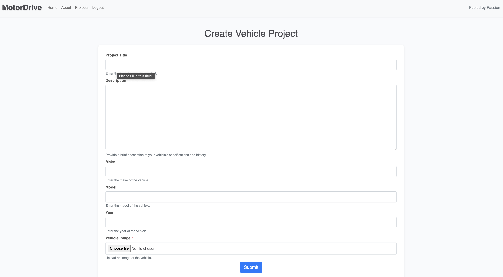

 

  

# Motordrive vehicle blog: 

#### The Ultimate Platform for Car Enthusiasts

Welcome to MotorDrive, your dedicated hub for car enthusiasts! Whether you're showcasing your vehicle builds, browsing others’ projects, or simply immersing yourself in the car community, MotorDrive has everything you need. Explore a platform built for gearheads to share, connect, and celebrate everything on four wheels!

  

## Deployed Site:

[Click here to view deployed site on Heroku](https://motordrive-bb11300a48d1.herokuapp.com/)

  

 /////// REPLACE WITH AM I RESPONSIVE IMAGE OF THE WEBSITE

  

## Table of Contents

- [Introduction](#introduction)

- [UX](#ux)

* [Account Creation and Login](#account-creation-and-login)

* [Dashboard Overview](#dashboard-overview)

* [Vehicle Build Management](#vehicle-build-management)

* [Customization and Personalization](#customization-and-personalization)

- [Project Planning](#project-planning)

* [Wireframes](#wireframes)

* [Database Schema](#database-schema)

- [Models](#models)

- [Agile Methodologies](#agile-methodologies)

* [Epics](#epics)

* [User stories](#user-stories)

* [Kanban board](#kanban-board)

- [Technologies Used](#technologies-used)

* [Languages](#languages)

* [Frameworks](#frameworks)

* [Libraries & Packages](#libraries--packages)

- [Future Features](#future-features)

- [Testing](#testing)

- [Deployment](#deployment)

* [Heroku](#heroku)

* [GitHub](#github)

- [Credits](#credits)

* [Media](#media)

* [Acknowledgements](#acknowledgements)

  

## Introduction

Introducing MotorDrive, the ultimate platform for car lovers and gearheads to share their vehicle builds, connect with other enthusiasts, and showcase their automotive passion. From custom mods to classic restorations, MotorDrive provides a space for users to upload pictures, detail their projects, and browse builds from the community. Whether you're just starting a build or already have a finished masterpiece, MotorDrive is your go-to platform.

  

## UX

The user experience of MotorDrive is designed to be straightforward and engaging, offering users an easy way to showcase and manage their vehicle builds, interact with other users, and explore the latest posts from the car community.

  

#### Account Creation and Login:

Users can quickly create an account by entering essential details like name, email, and a password. After signing up, logging in is seamless, and all personal data is securely handled using Django's **allauth** package.

  

#### Homepage Overview:

Once logged in, users are welcomed by a clean, user-friendly dashboard. This serves as their central hub to manage their vehicle projects, view their posts, and track any updates from other car enthusiasts. The layout ensures quick navigation and access to important actions like adding or editing vehicle builds.

  

#### Vehicle Build Management:

The core functionality of MotorDrive revolves around its ability to allow users to create, edit, and manage their vehicle projects. Users are notified of successful actions such as creating, editing, or deleting posts throughout their experience.

  

-  **Create**: Users can easily upload their vehicles by filling out a detailed form that includes fields for car make, model, year, modifications, and a description of the build. Users can also upload images of their car.

  

-  **Read**: All user posts are displayed on the 'Projects' page, where other users can explore builds, view vehicle details, and admire uploaded images.

  

-  **Update**: Users can easily edit their posts, changing any details or updating the build progress by modifying the information in the form. The editing process is intuitive, with the form pre-populated with the current data.

  

-  **Delete**: If a user decides to remove a post, they can do so with a simple click. Deleting a post removes it from the 'Projects' page, maintaining a clean and updated vehicle showcase.

  

## Project Planning

  

### Wireframes

Created using Wireframe.cc

#### Home Page

  

#### Projects Page

  

### Database Schema

  

### Models

#### User

The User model is based on Django's built-in authentication system, managing essential user information such as username, password, and email. It also allows users to have profiles where their builds are displayed.

  

#### Vehicle

The Vehicle model represents user-submitted cars. Each vehicle post includes fields for the car's make, model, year, description, images, and any modifications done to the car. Users can manage their own vehicle posts, including the option to edit or delete them.

  

#### Build Post

The Build Post model connects user-submitted vehicle information with the broader 'Projects' page, where all cars are showcased. It stores relevant data like vehicle details, image links, and build progress.

  

### Agile Methodologies

Development of MotorDrive followed agile methodologies, ensuring continuous delivery and integration of user feedback throughout the process.

  

#### Epics

The development was split into several epics: User Authentication, Build Post Management, and Vehicle Showcases. Each epic consisted of multiple user stories to help track the progress.

  

#### User Stories

1. As a user, I can create an account to manage my vehicle builds.

2. As a user, I can upload images of my vehicle to share with the community.

3. As a user, I can delete a build post if I no longer want it displayed on the site.

4. As a user, I can browse a page of vehicle projects and view the details of any post.

5. As a developer, I can deploy the app to Heroku to make it accessible to users.

  

#### Kanban board

[Click here to view Kanban board on Github](https://github.com/users/rhoshan-d/projects/2)

  

### Future Features

- Add a commenting system for users to discuss vehicle builds.

- Implement a search function for users to filter builds by car make or model.

- Allow users to like and share vehicle projects on social media.

  

### Technologies Used

  

#### Languages

- HTML

- CSS

- JavaScript

- Python

  

#### Frameworks

- Django - Python framework used for development.

- Bootstrap 5 - Used for styling the application.

  

#### Libraries & Packages

- Django Allauth - For user authentication.

- Crispy Forms - For rendering Django forms.

  

#### Tools & Programs

- VSCode

- GitHub

- Heroku

- Lucidchart - for database schema creation.

- Balsamiq - for wireframes.

  

### Testing

For full testing results see [TESTING.md](/TESTING.md)

  

### Deployment

  

#### Heroku

Heroku was used to deploy the site. To deploy:

  

1. Log in to Heroku.

2. Create a new app.

3. Set up environment variables.

4. Deploy from GitHub.

5. Open the deployed app.

  

#### GitHub

GitHub was used for version control and project management.

  

### Credits

- [startbootstrap.com](https://startbootstrap.com/) for some initial templates.

- [Unsplash](https://unsplash.com/) for free images used for car builds.

  

#### Acknowledgements

- Code Institute
- ChatGTP for wording