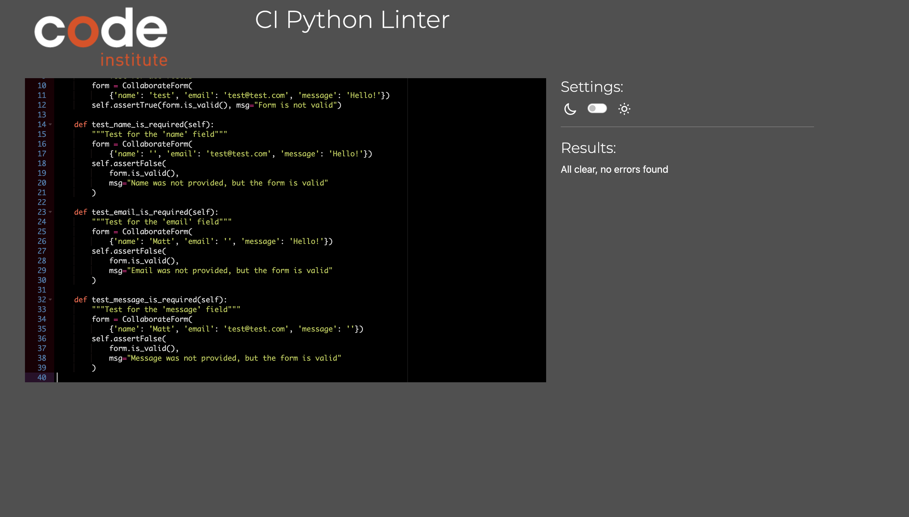
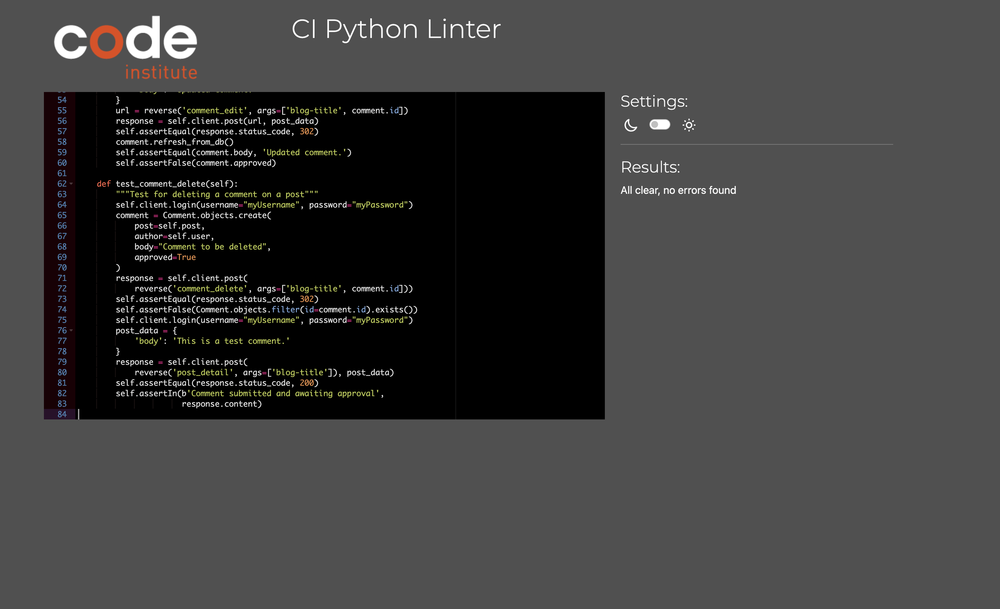

# Testing

## Contents

* [Automated Testing](#automated-testing)
* [Manual Testing](#manual-testing)
* [Responsive Design](#responsive-design-testing)
* [Lighthouse Testing](#lighthouse-testing)
* [Code Validation](#code-validation)

## Manual Testing 

### Navigation & Authentication

| Element               | Action | Expected Result                          | Pass/Fail |
|----------------------|--------|------------------------------------------|-----------|
| Home Link            | Click  | Redirects to home page                   | Pass      |
| Projects Link        | Click  | Redirects to projects page               | Pass      |
| Create Post Button   | Click  | Opens create project form                | Pass      |
| Sign Up Link         | Click  | Opens registration form                  | Pass      |
| Login Link           | Click  | Opens login form                         | Pass      |
| Logout Link          | Click  | Logs out user and redirects to home     | Pass      |

### Project Management

| Feature              | Action | Expected Result                          | Pass/Fail |
|----------------------|--------|------------------------------------------|-----------|
| Create Project       | Submit | Creates new project and redirects        | Pass      |
| Edit Project         | Submit | Updates project details                  | Pass      |
| Delete Project       | Click  | Shows confirmation and deletes           | Pass      |
| Like Project         | Click  | Toggles like status                      | Pass      |
| Project Year Field   | Input  | Only accepts valid year numbers         | Pass      |
| Project Image Upload | Submit | Successfully uploads vehicle image       | Pass      |
| Vehicle Make/Model   | Submit | Requires both fields to be filled       | Pass      |

### Collaboration Features

| Feature              | Action | Expected Result                          | Pass/Fail |
|----------------------|--------|------------------------------------------|-----------|
| Contact Form         | Submit | Sends message and shows confirmation     | Pass      |
| Empty Contact Form   | Submit | Shows validation errors                  | Pass      |
| Invalid Email        | Submit | Shows email format error                 | Pass      |
| About Page Link      | Click  | Displays about page with contact form    | Pass      |

### User Experience

| Feature              | Action | Expected Result                          | Pass/Fail |
|----------------------|--------|------------------------------------------|-----------|
| Project List View    | Load   | Shows all vehicle projects with images   | Pass      |
| Project Detail View  | Click  | Shows full project details              | Pass      |
| Project Sorting      | Load   | Displays projects in correct order      | Pass      |
| Form Validation      | Submit | Shows appropriate error messages        | Pass      |


## Automated testing

Automated Unit Testing was implemented using Django's TestCase framework to verify core functionality:

### Vehicle Projects App

+ Forms (TestVehicleProjectForm)
    - ```test_form_is_valid```: Validates form with complete vehicle data including image upload
    - ```test_form_is_invalid_missing_fields```: Verifies form rejection when required fields are missing
    - ```test_form_is_invalid_invalid_year```: Ensures year field validation works correctly
    - ```test_form_is_invalid_missing_image```: Confirms form requires vehicle image

### Comments System

+ Forms (TestCommentForm)
    - ```test_form_is_valid```: Verifies comment submission with valid data
    - ```test_form_is_invalid```: Tests form validation with empty comment body

+ Views (TestBlogViews)
    - ```test_render_post_detail_page_with_comment_form```: Verifies comment form appears on post detail page
    - ```test_successful_comment_submission```: Tests comment creation functionality
    - ```test_comment_edit```: Validates comment editing and approval status reset
    - ```test_comment_delete```: Confirms comment deletion works correctly

Each test class includes setUp methods to create required test users and data. Tests verify both successful operations and proper handling of invalid inputs.

## Responsive Design Testing

The site has been tested on the following devices:
- iPhone 12 Pro
- iPad Air
- Desktop (1920x1080)

## Lighthouse Testing

<p>


</p>

## Code Validation

### HTML
All pages have been tested using the [W3C HTML Validator](https://validator.w3.org/)

### CSS
CSS has been validated using the [W3C CSS Validator](https://jigsaw.w3.org/css-validator/)
<p>

</p>

### Python
All Python files have been validated using [CI Python Linter](https://pep8ci.herokuapp.com/)
<p>








</p>

### JavaScript
JavaScript files have been validated using [JSHint](https://jshint.com/)
<p>


</p>